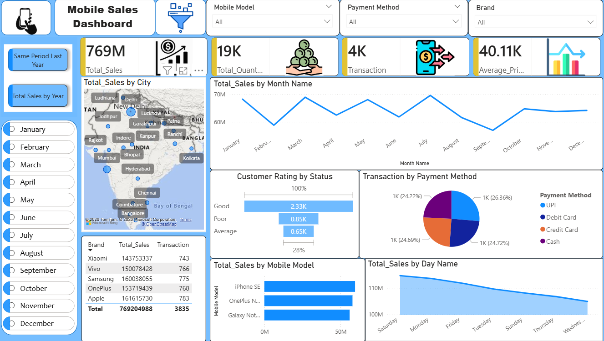
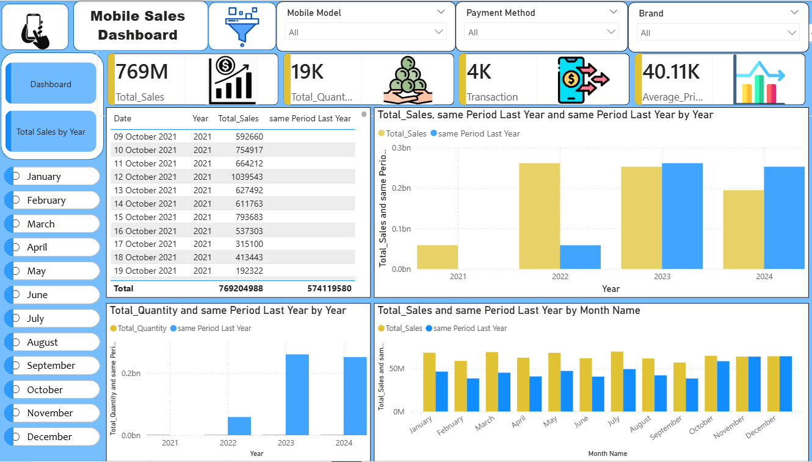

# 📱 Mobile Sales Dashboard | Power BI

## 🌟 Overview

This project presents a comprehensive Mobile Sales Dashboard built using Power BI to analyze sales performance, customer behavior, product trends, and regional performance. The dashboard transforms raw sales data into meaningful business insights through interactive visualizations and KPI tracking.

---

## 🎯 Project Goals

- Monitor overall sales performance.
- Track monthly and yearly sales trends.
- Analyze customer satisfaction through ratings.
- Identify top-performing mobile brands.
- Compare regional sales performance.
- Support data-driven decision-making.

---

## 🏆 Key Highlights

✔ Interactive Dashboard  
✔ Dynamic Filters & Slicers  
✔ DAX Measures & Calculations  
✔ Data Cleaning using Power Query  
✔ Business KPI Tracking  
✔ Sales Trend Analysis  
✔ Geographic Sales Insights

---

## 📊 Dashboard KPIs

| KPI | Description |
|------|-------------|
| Total Sales | Overall revenue generated |
| Total Quantity | Total units sold |
| Average Rating | Customer satisfaction score |
| Sales Growth % | Revenue growth over time |
| Top Brand | Best performing mobile brand |
| Top City | Highest revenue generating city |

---

## 📈 Visualizations Used

- KPI Cards
- Line Chart
- Clustered Column Chart
- Pie Chart
- Donut Chart
- Map Visual
- Slicers
- Interactive Filters

---

## 🔍 Insights Generated

### Sales Performance
- Identified peak sales periods.
- Analyzed revenue growth trends.

### Product Performance
- Compared sales across mobile brands.
- Determined best-selling products.

### Customer Analysis
- Evaluated customer ratings.
- Identified customer preferences.

### Regional Analysis
- Compared sales across cities.
- Highlighted top-performing regions.

---

## 🛠 Tech Stack

| Tool | Purpose |
|--------|---------|
| Power BI | Dashboard Development |
| DAX | KPI Calculations |
| Power Query | Data Cleaning |
| Excel/CSV | Data Source |

---

## 📂 Repository Structure

```text
Mobile-Sales-Dashboard/
│
├── MobileSaleDashboard.pbix
├── dashboard.png
├── README.md
└── Dataset.xlsx
```

---

## 📸 Dashboard Preview






---

## 💼 Business Value

The dashboard helps management:
- Track sales performance in real time.
- Identify profitable products and regions.
- Understand customer behavior.
- Make informed strategic decisions.

---

## 🚀 Future Improvements

- Forecasting using Time Series Analysis.
- Customer Segmentation.
- Profitability Analysis.
- Drill-through Reports.
- Mobile Responsive Dashboard.

---

## 👩‍💻 Author

### Sayali Aiwale
Aspiring Data Analyst

**Skills**
- Power BI
- SQL
- Excel
- Data Visualization
- Data Analytics
- Business Intelligence

---

### ⭐ If you like this project, please give it a star!# Mobile-Sales-Dashboard
Power BI Mobile Sales Dashboard with sales analysis, KPIs, and interactive visualizations.
